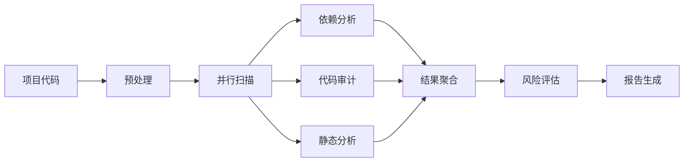

# 介绍

@ldesign/security 是一个全面、智能、易用的企业级 Node.js 安全扫描工具，旨在帮助开发团队及早发现和修复安全问题。

## 什么是 @ldesign/security？

@ldesign/security 是一个集成了多种安全检测能力的一站式安全解决方案，它能够：

- 🔍 **扫描依赖漏洞** - 从 NPM Audit、Snyk、NVD、OSV 等多个数据源聚合漏洞信息
- 🔐 **检测代码缺陷** - 基于 ESLint 的代码审计，发现潜在的安全问题
- 🔑 **发现敏感信息** - 检测硬编码的密钥、密码、令牌等敏感数据
- 💉 **防御注入攻击** - 识别 SQL 注入、XSS、命令注入、SSRF 等常见攻击向量
- 🔒 **加密安全检查** - 检测弱加密算法、不安全的随机数生成器、SSL/TLS 配置问题
- 🌐 **API 安全审计** - 检查 API 端点暴露、认证授权问题、CORS 配置等
- 🐳 **容器安全扫描** - Dockerfile 最佳实践检查和镜像漏洞扫描
- 🏛️ **合规性检查** - 支持 OWASP Top 10、PCI DSS、GDPR、SOC 2、CIS Benchmarks

## 为什么需要 @ldesign/security？

### 安全问题日益严重

根据统计：
- 85% 的应用程序存在安全漏洞
- 平均修复一个安全漏洞需要 38 天
- 数据泄露的平均成本为 424 万美元

### 现有工具的局限性

现有的安全工具往往存在以下问题：

1. **功能单一** - 只能检测某一类问题，需要组合多个工具
2. **误报率高** - 缺乏上下文分析，产生大量误报
3. **难以集成** - 与开发工作流割裂，开发者使用门槛高
4. **报告不友好** - 缺乏可视化，难以理解和追踪
5. **修复困难** - 只报告问题，不提供修复方案

### @ldesign/security 的优势

@ldesign/security 通过以下方式解决这些问题：

#### 1. 全面覆盖

一个工具解决所有安全问题，无需组合多个工具：

```
依赖漏洞 ✓   代码缺陷 ✓   敏感信息 ✓   注入攻击 ✓
加密安全 ✓   API 安全 ✓   容器安全 ✓   合规检查 ✓
```

#### 2. 智能精准

- 上下文感知分析
- 低误报率
- AI 辅助检测
- 300+ 精选规则

#### 3. 开发者友好

```bash
# 简单到一行命令
npx lsec scan

# 自动修复
npx lsec fix

# 可视化仪表板
npx lsec dashboard
```

#### 4. 持续保护

```
实时监控 → 自动扫描 → 智能告警 → 自动修复
```

#### 5. 企业就绪

- 多项目管理
- 策略配置
- 合规报告
- 审计日志
- SSO 集成
- 私有部署

## 核心特性

### 多维度安全检测

| 检测类型 | 说明 | 规则数 |
|---------|------|--------|
| 依赖漏洞 | 检测第三方依赖中的已知漏洞 | 50+ |
| 代码审计 | 基于静态分析的代码缺陷检测 | 80+ |
| 敏感信息 | 检测硬编码的密钥、密码等敏感数据 | 30+ |
| 注入攻击 | SQL、XSS、命令注入、SSRF 等 | 40+ |
| 加密安全 | 弱加密算法、不安全的 RNG、SSL/TLS 问题 | 50+ |
| API 安全 | 认证授权、CORS、Rate Limiting 等 | 40+ |
| 容器安全 | Dockerfile 最佳实践、镜像漏洞 | 60+ |
| 合规检查 | OWASP、PCI、GDPR、SOC 2、CIS | 200+ |

### 智能修复引擎

自动修复多种安全问题：

- ✅ 依赖版本升级
- ✅ 代码模式替换
- ✅ 配置文件优化
- ✅ 备份和回滚
- ✅ 修复预览

### 多样化报告

支持 7 种报告格式：

- **HTML** - 交互式 Web 报告
- **PDF** - 正式文档
- **JSON** - 机器可读
- **YAML** - 人类友好
- **SARIF** - 代码扫描标准
- **Markdown** - 文档集成
- **Excel** - 数据分析

### 持续监控

7x24 小时保护你的代码：

```
文件监听 → 变更检测 → 增量扫描 → 实时告警
```

- 实时文件监听
- Git Hooks 集成
- 定时扫描
- 增量检测
- 多渠道告警

### 丰富的集成

无缝融入你的工作流：

**Git 平台**
- GitHub (Actions, PR 评论, Code Scanning)
- GitLab (CI, MR 评论, Security Dashboard)
- Bitbucket (Pipelines, PR 评论)

**CI/CD**
- GitHub Actions
- GitLab CI
- Jenkins
- CircleCI
- Azure DevOps

**通知渠道**
- Slack
- 钉钉
- 企业微信
- Webhook
- Email

**开发工具**
- VS Code 插件
- Git Hooks
- Pre-commit
- Husky

## 工作原理

@ldesign/security 采用多阶段扫描流程：



### 1. 预处理阶段

- 读取配置文件
- 加载自定义规则
- 构建依赖图
- 初始化扫描器

### 2. 扫描阶段

并行执行多个扫描器：

- **VulnerabilityScanner** - 依赖漏洞
- **CodeAuditor** - 代码审计
- **SecretDetector** - 敏感信息
- **InjectionDetector** - 注入攻击
- **CryptoAnalyzer** - 加密安全
- **APISecurityChecker** - API 安全
- **ContainerScanner** - 容器安全

### 3. 分析阶段

- 聚合扫描结果
- 去重和合并
- 上下文关联
- 误报过滤
- 风险评分

### 4. 报告阶段

- 生成多格式报告
- 保存扫描历史
- 发送告警通知
- 触发后续动作

## 使用场景

### 开发阶段

```bash
# 开发时实时检测
lsec watch

# 提交前检查
lsec check
```

### 代码审查

```bash
# 对比分支差异
lsec compare --base main --target feature/new-api

# PR 自动评论
lsec git comment --pr 123
```

### CI/CD 集成

```bash
# CI 模式运行
lsec ci --fail-on high --sarif

# 自动修复并提交
lsec fix --auto-commit
```

### 定期审计

```bash
# 生成合规报告
lsec compliance --standard pci --output report.pdf

# 趋势分析
lsec history --trend
```

### 应急响应

```bash
# 快速扫描
lsec check

# 启动仪表板监控
lsec dashboard

# 检查特定漏洞
lsec check --cve CVE-2023-XXXXX
```

## 性能指标

典型项目扫描性能：

| 项目规模 | 文件数 | 依赖数 | 扫描时间 |
|---------|--------|--------|---------|
| 小型 | < 100 | < 50 | < 5s |
| 中型 | 100-500 | 50-200 | 5-15s |
| 大型 | 500-2000 | 200-500 | 15-60s |
| 超大型 | > 2000 | > 500 | 1-5min |

优化技巧：
- 启用增量扫描可减少 80% 时间
- 并行扫描可提升 3-5 倍速度
- 智能缓存可减少 50% 重复检测

## 下一步

- 📦 [安装和快速开始](./getting-started)
- 🧠 [理解核心概念](./concepts)
- ⚙️ [配置详解](../config/options)
- 📚 [API 参考](../api/scanner)
- 🔌 [集成指南](../integrations/overview)
